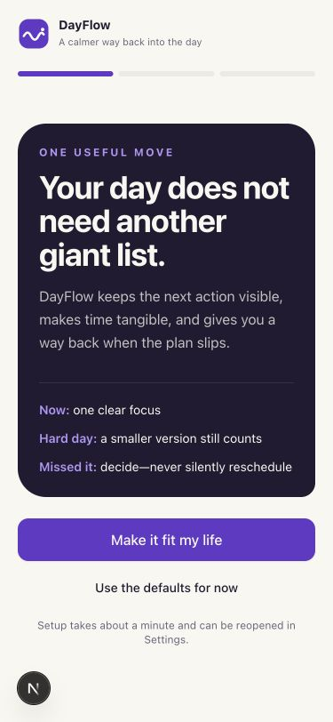
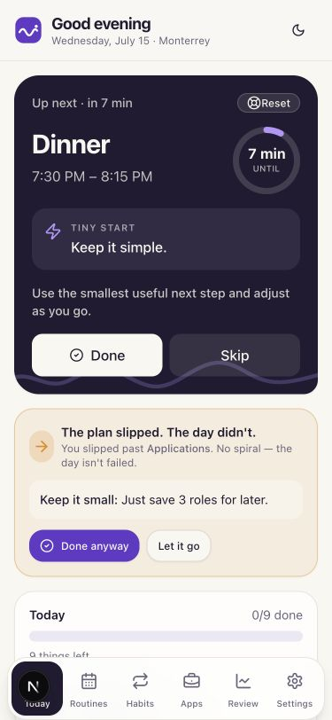
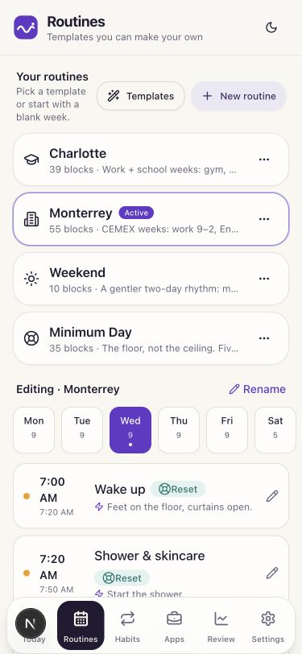

# DayFlow by Halynt

> A Halynt product.

DayFlow is a simple daily planner for people with ADHD. It keeps the next task
easy to find, makes routines editable, and gives people a lighter view when the
full day feels like too much.

[Open the live demo](https://habits-app-eta.vercel.app) · [View the repository](https://github.com/bryan0x01/Habits-App)

## Preview

| Quick setup | Today | Editable routines |
| --- | --- | --- |
|  |  |  |

## What it includes

DayFlow has five main screens and one optional career tool:

| Screen | What it does |
| --- | --- |
| **Today** | Shows the current task, what comes next, three priorities, today’s habits, and the rest of the plan when you want it. |
| **Routines** | Lets people start blank, edit a practical template, or turn a plain-language description into a routine they review before saving. |
| **Habits** | Tracks simple habits by category and shows progress over the last seven days without streaks. |
| **Weekly Review** | Summarizes completed work and shows transparent patterns learned from the last 28 days of check-ins. |
| **Settings** | Holds appearance, account, reminder, routine, backup, and reset controls. |
| **Applications** | An optional job application tracker available from Settings. |

New accounts start with generic routines and habits. Nothing includes a personal
employer, school, location, or private schedule. Every routine block can be
renamed, moved, duplicated, or removed.

## Why the interface works this way

- **One clear task:** the Today screen leads with the task that matters now.
- **A first step:** tasks can include an easy way to begin.
- **A backup option:** routine blocks can have a shorter version for lower-energy days.
- **Four capacity levels:** High, Good, Low, and Very low change how much the app shows.
- **Basics only:** hides anything that can wait without deleting it.
- **Three priorities:** keeps the day’s main outcomes separate from a longer list.
- **Seven-day progress:** shows completed days without creating a streak to maintain.
- **Simple skip notes:** people can record what got in the way and review patterns later.
- **Editable appearance:** light, dark, or system mode plus five account-synced interface colors.
- **Private list sorting:** “Clear my head” organizes tasks on the device using duration, importance, energy, and past check-ins.
- **Reviewed routine drafts:** a local parser understands common day and time phrases, but it cannot save or change a schedule without approval.
- **Transparent patterns:** DayFlow looks for repeated timing, task-size, energy, and friction patterns without sending saved history anywhere.
- **Visible time:** current blocks use a time ring, with optional 10, 25, and 45-minute focus timers.
- **A short setup:** onboarding asks what kind of help is useful, suggests a routine, and offers account creation.

## Accounts and saved data

[Clerk](https://clerk.com/) handles account creation and sign-in. [Supabase](https://supabase.com/)
stores one private, row-level-security-protected DayFlow snapshot for each Clerk
user. `CloudProvider` asks Clerk for the current session token and passes it to
the Supabase client.

The saved snapshot includes:

- routines and their blocks;
- habits and dated check-ins;
- settings and appearance;
- priorities, flexible tasks, and weekly plans;
- applications, capacity logs, and skip notes.

Signed-out use is a temporary preview. It stays in memory and resets when the
page refreshes. DayFlow does not save product data in localStorage.

## Tech stack

- Next.js 15 App Router and React 19
- TypeScript in strict mode
- Tailwind CSS 3 and shadcn/ui
- Clerk for authentication
- Supabase for private account data
- A private on-device planning engine for routine drafts, task sorting, and learned preferences
- date-fns for date and schedule logic
- Lucide icons
- Vitest and Playwright
- Web app manifest, service worker, generated PWA icons, and web push

## Project structure

```text
src/
├── app/                  # Product screens and Clerk auth routes
├── components/           # Feature components and shadcn/ui primitives
├── middleware.ts         # Clerk session middleware
└── lib/
    ├── data/             # Generic routine and habit starters
    ├── supabase/         # Clerk-token-aware browser client
    ├── schedule.ts       # Current, next, and missed-block logic
    ├── local-planning-engine.ts # Private prompt parsing and adaptive ordering
    ├── patterns.ts       # Private 28-day adaptation from check-ins
    ├── planner.ts        # Local list parsing and plan adjustment
    ├── day-state.ts      # Daily habit state and seven-day progress
    ├── storage.ts        # Snapshot validation and file import/export
    └── types.ts          # Serializable data models
supabase/
├── migrations/           # Snapshot, push, hardening, and Clerk migrations
└── functions/            # Reminder delivery
tests/                    # Domain, component, and browser regression tests
```

## Run locally

Use Node 20 or newer.

```bash
npm install
npm run dev
```

Open [http://localhost:3000](http://localhost:3000). The signed-out preview works
without environment variables. Account creation and cloud saving need the Clerk
and Supabase values listed in [the setup guide](docs/SUPABASE_SETUP.md). The
planning engine needs no API key or external service.

Useful commands:

```bash
npm run dev              # local development
npm run check            # lint, domain tests, component tests, and production build
npm run test:e2e         # onboarding and very-low-mode browser flows
npm run icons            # rebuild PWA icons
```

The service worker only registers in production. Use `npm run build` followed by
`npm start` to test installation and offline behavior.

## Deploy

1. Import the repository in Vercel.
2. Add the Clerk and Supabase environment variables from the setup guide.
3. Apply every migration in `supabase/migrations/`.
4. Connect Clerk as a Supabase third-party authentication provider.
5. Redeploy after changing environment variables.

Reminder delivery also needs the VAPID secrets, Edge Function, and one-minute
cron described in [the notification guide](docs/NOTIFICATIONS_SETUP.md).

Routine descriptions and brain dumps are processed in the browser. The local
engine recognizes common English and Spanish day/time phrases, rejects overlaps,
and uses recent check-ins only to tune unspecified times and task ordering. Every
routine still requires a visible review before it can be saved. See the
[planning-engine guide](docs/LOCAL_PLANNING_ENGINE.md).

## Current roadmap

- Better handling when two devices edit the same plan at once
- Calendar connections
- More browser coverage for each screen
- Broader language coverage for the private routine builder

## Resume notes

- Built a mobile-first productivity PWA with Next.js, TypeScript, Tailwind CSS,
  Clerk authentication, and an RLS-protected Supabase data layer.
- Implemented editable routine scheduling, capacity-aware views, habit progress,
  weekly review, and an optional application tracker.
- Added account-synced appearance, file backup, installable PWA support, web push,
  and cross-midnight reminder deduplication.
- Added reviewed local routine generation, adaptive brain-dump organization, and
  private behavior-pattern suggestions with no paid AI dependency.
- Added regression coverage for domain rules, rendered components, onboarding,
  account persistence, and the three-choice very-low view.

DayFlow by Halynt is built for people who want a plan that is clear, flexible,
and easy to come back to.
